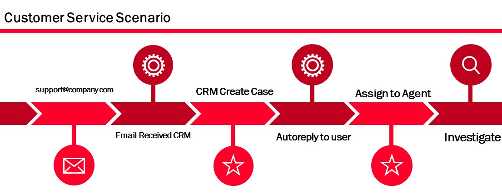

# Simplifying Customer Service
Welcome to my community solution for simplifying the Customer Service.  
This is a part of a blog series you can find on my blog https://crmkeeper.com/dynamics-365-customer-service/ 

  

## Scenario

Before you start downloading the solution, you should head on over to my blog post where I explain how to implement everything.  
*URL*  
I would prefer to download the solution as unmanaged. I only add things that you easily can remove afterwords. Every form I create is custom, and should not overwrite anything you have from before. This is why I am sayin it should be safe to import as unmanaged solution. I am not an ISV, so therefore the configuration is not to be considered as an ISV solution either. 

The following is a list of what is included in the Solution file. 

## Account:
### Form:
Account Main - CS <- Main form for account. 
Recent Cases - CS <- Quick View Form for Cases

## Appointment, Email, Note, Phone Call and Task
### Relationship:
N:1 relationship updated to configurable cascading, and Assign set to "Cascade None". Default behaviour is Parental. This had to be done, because the assigning of case will mess with the date stamps on case activities. 

## Case:
### Form:
Case Main - CS <- Main form for case

### View:
Active Cases - CS <- Main view for all cases
Active Cases Team - CS <- All cases assigned to the team
My Active Cases - CS <- The cases assigned to you

### Field:
Field: Case Number (ticketnumber) - I overwrite the autonumber. Default Value is CAS-{SEQNUM:5}-{RANDSTRING:6} if you wan to revert
Field: Last Activity Date "cs_lastactivitydate" - Updates whenever a new email is received. Feel free to use field for Tasks or other avtivities as needed. 

## Email:
Javascript file CS_Email

## Workflow:
Email - Update Case Last Email

## User:
Field: Signature "cs_signature"

## Signature (NEW)
Entity "cs_Signature"

## Customer Service Hub APP
I add forms to app. Email and Case

## Contact: 
Quick view Recent Cases
